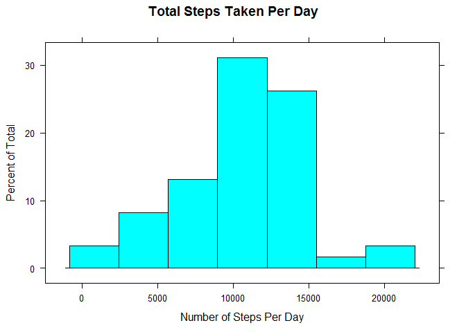

# Reproducible Research: Peer Assessment 1


## Introduction

This assignment looks at an activity monitoring device that has data available for a 2 month period from Oct to Nov 2012. The data can be downloaded here:
[Active monitoring data](https://d396qusza40orc.cloudfront.net/repdata%2Fdata%2Factivity.zip). The device monitors the number of steps of the person at five minute intervals. We do a data analysis with R code and data visualization with plots.


## Loading and preprocessing the data

We first load the dataset into a data table using the *data.table* package. For plotting, we use the *lattice* package.

```r
library(data.table)
library(lattice)
DT <- fread("activity.csv", sep=",")
```


## What is mean total number of steps taken per day?

For this this part of the assignment, we ignore missing values denoted as **NA**. To get the total number of steps per day, we aggregate the data table to get the sum of the steps by date.

```r
dailyTotalSteps <- DT[,list(sum=sum(steps)),by=date]
```


We plot the histogram.

```r
histogram(~ sum, data = dailyTotalSteps,
          xlab="Number of Steps Per Day",
          main="Total Steps Taken Per Day")
```

 


The **mean** of the total number of steps taken per day is calculated and shown.

```r
mean(dailyTotalSteps$sum, na.rm = TRUE)
```

```
## [1] 10766.19
```


The **median** of the total number of steps taken per day is calculated and shown.

```r
median(dailyTotalSteps$sum, na.rm = TRUE)
```

```
## [1] 10765
```


## What is the average daily activity pattern?

To find the average number of steps taken, averaged across all days, we aggregate the data table to get the mean of the steps by interval. This will be used as the y-axis in the plot below.

```r
averageStepsPerDay <- DT[,list(average=mean(steps, na.rm=TRUE)),by=interval]
```


We make a time series plot.

```r
xyplot(average ~ interval, data = averageStepsPerDay,
       main="Average Daily Activity Pattern",
       xlab="Interval",
       ylab="Number of Steps",
       type='l',
       col="red")
```

 


The **5-minute interval with the maximum number of steps**, on average across all the days in the dataset is calculated and shown.

```r
averageStepsPerDay$interval[which.max(averageStepsPerDay$average)]
```

```
## [1] 835
```


## Imputing missing values

The **total number of missing values** in the dataset is calculated and shown.

```r
indexNA <- which(is.na(DT$steps))
length(indexNA)
```

```
## [1] 2304
```


Since the missing values may introduce bias into our results, in this step we replace them with data. In order to fill the missing values, the strategy of replacing them with the mean for that 5-minute interval was used. First we create a new dataset that will be equal to the original dataset but with the missing data filled in.

The following code was implemented for this task. The *for* loop runs for the length of the number of missing values. We overwrite the steps at the missing value index with the mean at the index, where the interval of the mean from the aggregated data is equal to interval from the complete data table.

```r
DT.noNA <- DT
for (row in 1:length(indexNA))
    DT.noNA$steps[indexNA[row]] <- averageStepsPerDay$average[which(averageStepsPerDay$interval == DT.noNA$interval[indexNA[row]], arr.ind=TRUE)]
```


To get the total number of steps per day, we aggregate the new filled data table to get the sum of the steps by date.

```r
dailyTotalSteps.noNA <- DT.noNA[,list(sum=sum(steps)),by=date]
```


We plot the histogram.

```r
histogram(~ sum, data = dailyTotalSteps.noNA,
          xlab="Number of Steps Per Day",
          main="Total Steps Taken Per Day",
          col="green")
```

 


The **mean** of the total number of steps taken per day is calculated and shown.

```r
mean(dailyTotalSteps.noNA$sum)
```

```
## [1] 10766.19
```


The **median** of the total number of steps taken per day is calculated and shown.

```r
median(dailyTotalSteps.noNA$sum)
```

```
## [1] 10766.19
```


In summary, we have:

* Data table with missing values

        Mean  : 10766.19
        Median: 10765
* Data table with filled values

        Mean  : 10766.19
        Median: 10766.19

As we can see, the values are nearly identical before and after, except now the median is exactly the same as the mean. This is to be expected since we used the strategy of filling in with the mean. We also notice small changes in the two histograms before and after such as a higher peak in the middle after filling in the values.


## Are there differences in activity patterns between weekdays and weekends?

In this part of the assignment we wish to a create conditioning plot by looking at the average number of steps taken for weekdays and weekends. The new filled data table is used. We create a factor variable, *f*, that has two levels: "weekday" and "weekend". Also, we convert the date column to the "Date" class so that we may use the *weekdays* function.

```r
DT.noNA$f <- factor(c("weekend", "weekday"))
DT.noNA$date <- as.Date(DT.noNA$date)
```


A *for* loop is used to check if the date for each row is a weekend or weekday. Since the *weekdays* function returns the day of the week from a given date, we can use *if-else* statements to update the factor variable with the correct levels.

```r
for (row in 1:nrow(DT.noNA)) {
    if (weekdays(DT.noNA$date[row]) == "Saturday" | weekdays(DT.noNA$date[row]) == "Sunday")
        DT.noNA$f[row] <- "weekend"
    else
        DT.noNA$f[row] <- "weekday"
}
```


To find the average number of steps taken, averaged across all weekday days or weekend days, we aggregate the new filled data table to get the mean of the steps by interval. This will be used as the y-axis in the plot below.

```r
averageStepsPerDay.noNA <- DT.noNA[,list(average=mean(steps)),by=list(interval,f)]
```


We make a time series panel plot using the factor, *f*, as the conditioning variable.

```r
xyplot(average ~ interval | f, data = averageStepsPerDay.noNA,
       main="Average Daily Activity Pattern",
       xlab="Interval",
       ylab="Number of Steps",
       type='l',
       layout = c(1,2))
```

 


Looking at the panel plot above, we can see that on weekends there is more activity with the greater number of peaks. This would make sense since the person most likely has more time to exercise then. We also see that on the weekdays there is the greatest peak in the morning at 8:35 as we noted earlier. A possibility is that the person did most of the weekday exercises in the short time before leaving for work or school.
